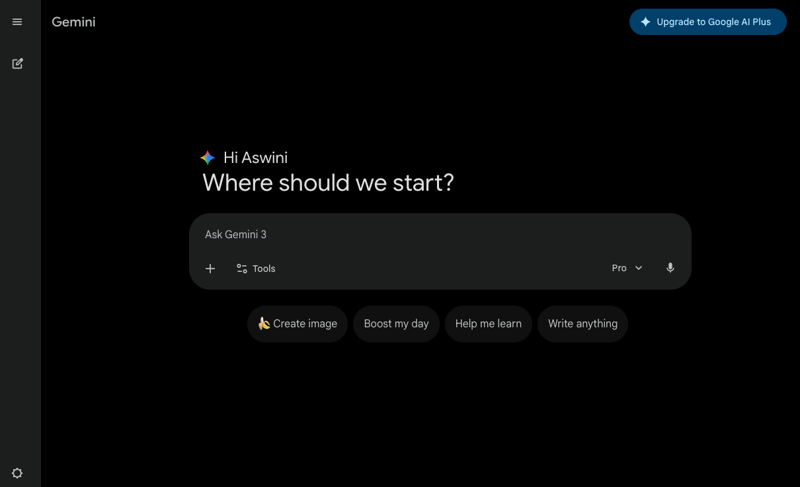

# Gemini Desktop

A simple macOS Electron app that opens **Google Gemini** in a native window—so you can use Gemini with a dedicated app icon, Dock presence, and window management without keeping a browser tab open.

---

## Screenshot

After launching the app and signing in with your Google account, you’ll see the familiar Gemini interface ready to go:



*The Gemini Desktop app welcome screen. Sign in with your Google account to start chatting with Gemini.*

---

## Features

- **Native macOS app** — Runs as a standalone application with its own Dock icon and window
- **Google Gemini in a window** — Loads [gemini.google.com](https://gemini.google.com) in a clean, focused window
- **Sensible defaults** — Window size 1280×800, minimum 900×600; sandbox and context isolation enabled
- **macOS-friendly** — Stays running when all windows are closed (standard macOS app behavior)

---

## Prerequisites

- **Node.js** (v18 or later recommended)
- **macOS** (Apple Silicon or Intel)

---

## Quick Start

### 1. Install dependencies

```bash
npm install
```

### 2. Run the app

```bash
npm start
```

The app opens a window to Google Gemini. Sign in with your Google account if prompted.

---

## Building the macOS app

To create a distributable macOS application:

```bash
npm run build:mac
```

**Output:**

- **ZIP:** `dist/Gemini Desktop-<version>-mac.zip` — share or install elsewhere
- **App bundle:** `dist/mac-arm64/Gemini Desktop.app` — run directly or drag to Applications

Install by unzipping the ZIP and moving **Gemini Desktop.app** to your Applications folder.

---

## Project structure

| Path           | Description                                      |
|----------------|--------------------------------------------------|
| `main.js`      | Electron main process; creates window and loads Gemini |
| `package.json` | App metadata, scripts, and build config         |
| `assets/`      | Icons and screenshots                            |

---

## Tech stack

- [Electron](https://www.electronjs.org/) — Cross-platform desktop shell
- [electron-builder](https://www.electron.build/) — Packaging for macOS

---

## License

ISC
